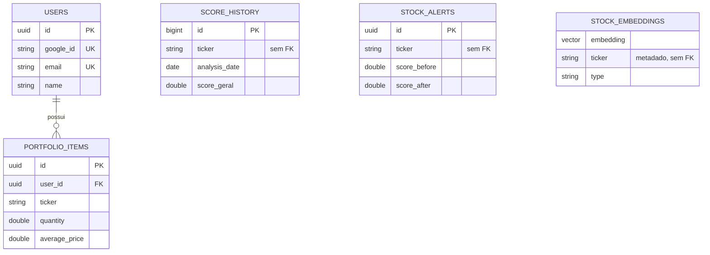
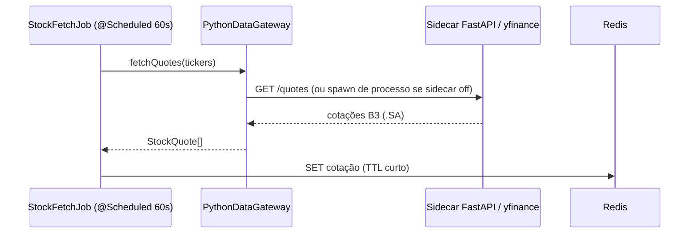
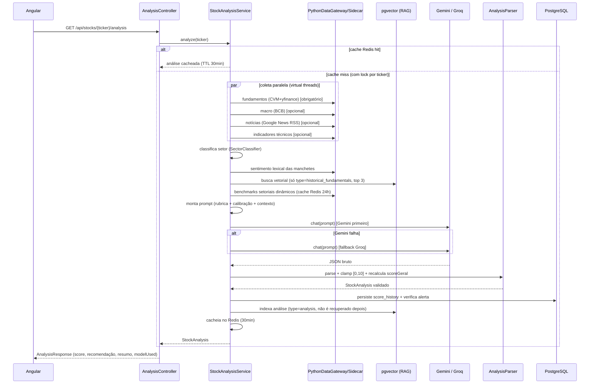
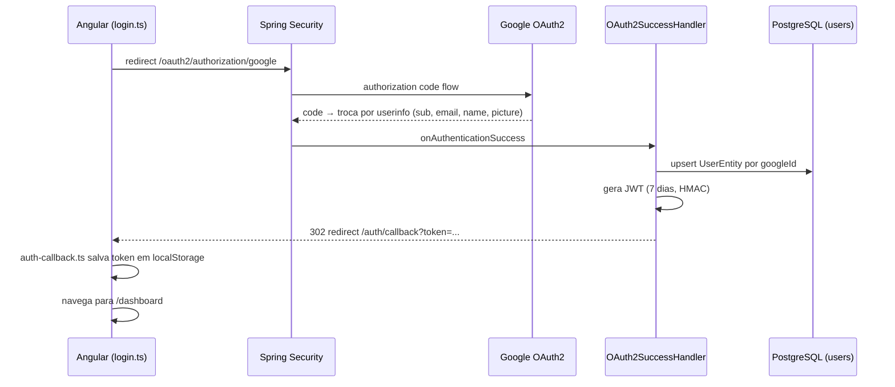

# stock-ai-analyzer — Documentação Técnica Completa

> Gerado em 2026-08-06 para consumo por outra IA (arquiteto de software / consultor técnico). Baseado em leitura direta do código-fonte, `pom.xml`, `package.json`, `application.yml`, `docker-compose.yml`, `CLAUDE.md` e `docs/ROADMAP.md`. Onde uma informação não pôde ser confirmada no código, isso é dito explicitamente em vez de presumido.

---

## 1. Visão Geral

### Objetivo do sistema
**stock-ai-analyzer** é um sistema de análise de ações da bolsa brasileira (B3) que combina cotações em tempo (quase) real com um **score de investimento gerado por IA**, composto por 6 dimensões independentes. O objetivo é dar a um investidor pessoa física uma leitura estruturada e fundamentada de uma ação — não uma recomendação imperativa de compra/venda (por restrição regulatória, ver Seção 11 e 6).

### Problema que resolve
Investidores individuais brasileiros normalmente precisam cruzar manualmente: demonstrativos contábeis (CVM), cotações e indicadores técnicos (terminal/yfinance), contexto macroeconômico (Selic, IPCA, câmbio), notícias e múltiplos comparáveis do setor. O sistema automatiza essa coleta multi-fonte, injeta os dados em um LLM com uma rubrica de pontuação explícita, e devolve um score 0–10 por dimensão com justificativa textual — reduzindo o trabalho manual de triagem fundamentalista.

### Público-alvo
Investidor pessoa física brasileiro que acompanha ações da B3, sem acesso a terminais profissionais (Bloomberg/Economatica). Não é destinado a uso por analistas credenciados como ferramenta de recomendação formal (ver disclaimer de conformidade CVM).

### Principais funcionalidades
- Dashboard com cotações B3 em tempo quase real (polling, não WebSocket — ver Seção 12).
- Análise de ação individual: score de investimento 0–10 em 6 dimensões, com explicação textual por dimensão gerada por LLM.
- Comparação lado a lado de até 5 tickers.
- Carteira do usuário (portfolio): CRUD de posições + avaliação da carteira pela IA.
- Simulador de alocação: sugestão de distribuição de um valor em dinheiro entre ações com base no score.
- Alertas automáticos de variação relevante de score (Δ > 1.5).
- Backtesting de correlação entre score e retorno realizado (endpoint existe, **não exposto no frontend** — roadmap P3).
- Login via Google OAuth2 + JWT próprio.

### Status atual do projeto
Projeto em desenvolvimento ativo, sem deploy em produção conhecido (não há Dockerfile de aplicação, nem pipeline de CI/CD, nem ambiente de produção configurado). Um overhaul relevante de precisão/confiabilidade foi concluído em commits recentes (ver Seção 15/`ROADMAP.md`): sidecar Python persistente, fundamentos oficiais da CVM como fonte primária, linguagem de recomendação CVM-compliant, benchmarks setoriais dinâmicos, e tratamento específico para bancos/financeiras. Cobertura de testes é baixa (3 classes de teste no backend, 1 spec padrão não customizado no frontend).

---

## 2. Arquitetura

### Arquitetura utilizada
Monólito modular Spring Boot no backend + SPA Angular standalone-components no frontend + **sidecar Python** (FastAPI) para acesso a bibliotecas de dados de mercado (yfinance/pandas) que não têm equivalente maduro em Java. Não é uma arquitetura de microsserviços — o sidecar é um processo auxiliar de dados, sem lógica de negócio própria, chamado apenas pelo backend Java.

Camadas lógicas:
```
Angular SPA  ──HTTP/REST──▶  Spring Boot backend  ──HTTP local──▶  FastAPI sidecar (Python)
                                     │                                    │
                                     ├──▶ PostgreSQL (dados relacionais)  ├──▶ yfinance (cotações/mercado)
                                     ├──▶ PostgreSQL+pgvector (embeddings)├──▶ CVM dados abertos (fundamentos oficiais)
                                     ├──▶ Redis (cache)                  ├──▶ BCB SGS/Olinda (macro)
                                     └──▶ Gemini / Groq (LLM, via HTTPS) └──▶ Google News RSS (notícias)
```

### Padrões de projeto
- **Gateway**: `PythonDataGateway` — ponto único de acesso aos dados Python; prefere o sidecar HTTP e cai para spawn de processo (`PythonScriptRunner`) com cooldown de 30s se o sidecar estiver fora do ar. Todos os consumidores (StockAnalysisService, StockFetchJob, HistoricalIndexingJob, BacktestService) passam por esse gateway — nenhum chama `PythonScriptRunner` diretamente.
- **Cache-aside**: Redis para cotações (TTL curto), análises (30 min), benchmarks setoriais (24h).
- **Single-flight / lock por chave**: `ConcurrentHashMap<String, ReentrantLock>` em `StockAnalysisService` garante que requisições simultâneas do mesmo ticker compartilhem uma única análise, evitando chamadas duplicadas e caras ao LLM.
- **Fallback em cadeia (Chain of Responsibility informal)**: Gemini → Groq no LLM; CVM → yfinance nos fundamentos; sidecar → spawn de processo no acesso a dados Python; benchmark dinâmico → benchmark estático por setor.
- **RAG (Retrieval-Augmented Generation)**: contexto histórico de fundamentos (não de análises passadas — decisão deliberada, ver Seção 8) recuperado via busca vetorial (pgvector) e injetado no prompt.
- **DTO/Record**: uso extensivo de `record` Java para DTOs imutáveis (StockFundamentals, MacroData, TechnicalIndicators, SentimentResult, NewsItem, etc.).
- **Strategy via mapa de configuração**: `SectorPromptConfig` e `SectorBenchmarks` mapeiam `SectorType` → texto de instrução / faixas de benchmark, sem hierarquia de classes.

### Organização em módulos (pacotes Java, todos sob `com.stockai`)
| Pacote | Responsabilidade |
|---|---|
| `stock` | Cotações e leitura de cache de mercado |
| `analysis` | Orquestração do score de IA, parsing/validação, comparação, backtesting, embeddings, benchmarks setoriais, integração LangChain4j — o módulo mais denso do sistema |
| `scheduler` | `PythonDataGateway`, `PythonScriptRunner`, jobs agendados (`StockFetchJob`, `HistoricalIndexingJob`) |
| `cache` | Abstração sobre Redis (`RedisStockCache`, usa SCAN, nunca KEYS) |
| `auth` | OAuth2 Google + emissão/validação de JWT |
| `user` | Entidade de usuário |
| `portfolio` | Carteira do usuário: CRUD, avaliação por IA, sugestão de alocação |

### Estrutura de pacotes (backend, achatada — não há sub-pacotes)
Cada um dos 7 pacotes acima é uma pasta única sem subdivisão adicional (ex.: `com.stockai.analysis` contém ~35 classes/records lado a lado, incluindo controllers, services, records de domínio e configuração). Não há separação formal em camadas `domain`/`application`/`infrastructure` — o pacote já é a unidade de organização, e dentro dele controller/service/entity/DTO convivem.

### Fluxo geral da aplicação
1. **Job agendado** (`@Scheduled`, a cada 60s) busca cotações B3 via `PythonDataGateway` (yfinance, sufixo `.SA`) e grava no Redis com TTL curto.
2. **Frontend consome via polling REST** a cada 30s (não há WebSocket funcional — ver Seção 12).
3. Usuário solicita análise de um ticker → `StockAnalysisService` coleta fundamentos/macro/notícias/técnicos em paralelo (virtual threads), classifica o setor, busca contexto RAG, monta prompt com rubrica + benchmarks, chama Gemini (fallback Groq), valida/clampa o resultado em `AnalysisParser`, persiste histórico + alertas + embeddings, cacheia no Redis por 30 min.
4. Usuário pode montar carteira, pedir avaliação da carteira (reusa o pipeline de análise por ticker) ou simular alocação de um valor.

### Decisões arquiteturais importantes
- **`scoreGeral` nunca vem do LLM** — é sempre recalculado em Java como média das 6 dimensões (comentário no código: "LLMs erram aritmética e o valor retornado pelo modelo é descartado").
- **RAG deliberadamente exclui análises passadas** do próprio sistema, usando apenas `historical_fundamentals` — evita que o LLM ancore no seu próprio score anterior (feedback loop).
- **Temperature 0** nos dois modelos — scoring precisa ser determinístico; variância de amostragem geraria alertas de score por ruído, não por mudança real.
- **CVM como fonte primária de fundamentos**, yfinance como fallback — comentário no código explica que os múltiplos do yfinance para B3 são "frequentemente errados ou defasados".
- ~~**`ddl-auto: update` em vez de Flyway**~~ — resolvido em 2026-08-06: Flyway (`db/migration/V{n}__*.sql`) + `ddl-auto: validate`. Ver `docs/ai/decisions.md`.
- **Sidecar Python em vez de reescrever coleta de dados em Java** — reaproveita o ecossistema yfinance/pandas, que não tem equivalente maduro na JVM; troca simplicidade de deploy (2 runtimes) por velocidade de desenvolvimento e precisão dos dados.
- **Benchmarks setoriais dinâmicos** foram criados porque, sem eles, "o LLM inventa a média setorial de memória — e os dois modelos (Gemini/Groq) inventam valores diferentes" (comentário no código).

---

## 3. Stack Tecnológica

| Camada | Tecnologia | Por que foi escolhida (evidência no código/config) |
|---|---|---|
| Linguagem backend | Java 26 | `java.version=26` no `pom.xml`; usa virtual threads (`Executors.newVirtualThreadPerTaskExecutor()`) para paralelizar I/O de coleta de dados sem gerenciar pool de threads manualmente |
| Framework backend | Spring Boot 4.0.6 | Parent do `pom.xml`; Spring Boot 4 usa `tools.jackson.*` em vez de `com.fasterxml.jackson.*` (nota explícita no CLAUDE.md do projeto) |
| Segurança | Spring Security + OAuth2 Client | Login delegado ao Google, sem senha local própria |
| Autenticação de API | JWT (`io.jsonwebtoken` / jjwt 0.12.6) | Token stateless de 7 dias emitido após login OAuth2, validado em filtro próprio (`JwtAuthFilter`) |
| Banco relacional | PostgreSQL 17 (`pgvector/pgvector:pg17`) | Mesma instância serve dados relacionais (usuários, carteira, histórico de score) e vetores (embeddings) — evita operar um banco vetorial separado |
| Extensão vetorial | pgvector (via LangChain4j `langchain4j-pgvector`) | Armazena embeddings de fundamentos/análises/histórico para RAG |
| Cache | Redis 7 (`redis:7-alpine`) | Cache de cotações, análises (30 min), benchmarks setoriais (24h); acesso via SCAN (nunca KEYS, evita bloqueio em produção) |
| Orquestração de LLM | LangChain4j 1.11.0 (`langchain4j-ollama`, `langchain4j-open-ai`) + `langchain4j-pgvector` 1.10.0-beta18 | Abstrai Gemini/Groq/Ollama atrás da mesma interface `ChatModel`/`EmbeddingModel`; versão do módulo pgvector pinada separadamente porque tem ciclo de release próprio (comentário explícito no `pom.xml`) |
| LLM primário | Gemini 2.5 Flash (via endpoint OpenAI-compatible do Google) | Chamado através de `OpenAiChatModel`, não de um módulo Gemini nativo do LangChain4j |
| LLM fallback | Groq `qwen/qwen3-32b` (via endpoint OpenAI-compatible da Groq) | Garante disponibilidade quando Gemini falha |
| Embeddings | `nomic-embed-text` via Ollama local (768 dimensões) | Evita custo/latência de API de embedding hospedada; dimensão fixada em config para não depender de round-trip HTTP no startup |
| Frontend | Angular 21 (standalone components, sem NgModules) | `@angular/core` `^21.2.0`; roteamento via `loadComponent` lazy |
| Linguagem frontend | TypeScript 5.9 | — |
| Reatividade frontend | RxJS 7.8 | — |
| Testes frontend | Vitest 4 + jsdom | Angular 21 migrou de Karma/Jasmine para Vitest |
| Estilo frontend | SCSS puro com variáveis CSS (sem Tailwind/Bootstrap) | Design system definido em `CLAUDE.md` (fontes Syne/Inter, paleta fixa) |
| Fonte de dados de mercado | yfinance (Python, não-oficial) | Cotações em tempo quase real e fallback de fundamentos |
| Fonte de fundamentos oficiais | Dados abertos da CVM (ITR/DFP/FCA) | Demonstrativos contábeis oficiais, tratados como "ground truth" no comentário do código |
| Fonte de dados macro | APIs abertas do BCB (SGS + Olinda/Focus) | Selic, IPCA, câmbio, expectativas de mercado |
| Fonte de notícias | Google News RSS | Sem chave de API, só `urllib` + `xml.etree` |
| Sidecar de dados | Python 3 + FastAPI + Uvicorn | Expõe scripts yfinance/pandas via HTTP local persistente, evitando cold-start de 2–5s por chamada via spawn de processo |
| Build backend | Maven (`mvnw`) | — |
| Build frontend | Angular CLI / npm | `npm@11.15.0` |
| Infra local | Docker Compose (rodado via **podman**, não docker — preferência registrada do usuário) | `docker-compose.yml` na raiz sobe só Postgres+pgvector e Redis; app roda nativo |
| Mensageria | **Não há** | Nenhum broker (Kafka/RabbitMQ) identificado no projeto |
| ORM | Spring Data JPA / Hibernate | `ddl-auto: validate`; schema versionado via Flyway desde 2026-08-06 |

---

## 4. Estrutura do Projeto

```
stock-ai-analyzer/
├── docker-compose.yml            # só infra: postgres (pgvector) + redis
├── .env.example                  # chaves de config (POSTGRES_*, REDIS_*, GEMINI_API_KEY, GROQ_API_KEY, GOOGLE_CLIENT_*, JWT_SECRET, OLLAMA_BASE_URL)
├── CLAUDE.md                     # guia do repositório para agentes de IA (íntegra na Seção 18)
├── docs/
│   └── ROADMAP.md                # estado do overhaul + backlog priorizado P0–P3
├── backend/                      # Spring Boot 4 / Java 26 (Maven)
│   ├── pom.xml
│   ├── scripts/                  # sidecar + scripts Python standalone
│   │   ├── sidecar_app.py        # FastAPI: expõe todos os scripts via HTTP :8001
│   │   ├── cvm_data.py           # fundamentos oficiais CVM (ITR/DFP/FCA), cache em .cvm_cache/
│   │   ├── fetch_fundamentals.py # orquestra yfinance + overlay CVM
│   │   ├── fetch_sector_benchmarks.py
│   │   ├── fetch_technical_indicators.py
│   │   ├── fetch_macro.py        # BCB SGS + Focus/Olinda + Brent/WTI (yfinance futures)
│   │   ├── fetch_news.py         # Google News RSS
│   │   ├── analyze_sentiment.py  # sentimento lexical (não é FinBERT)
│   │   └── requirements.txt
│   └── src/
│       ├── main/java/com/stockai/
│       │   ├── analysis/         # score de IA, parsing, RAG, benchmarks, comparação, backtest (~35 classes)
│       │   ├── auth/             # SecurityConfig, JwtService, JwtAuthFilter, OAuth2SuccessHandler
│       │   ├── cache/            # RedisStockCache
│       │   ├── portfolio/        # PortfolioController/Service/Item/Repository
│       │   ├── scheduler/        # PythonDataGateway, PythonScriptRunner, StockFetchJob, HistoricalIndexingJob
│       │   ├── stock/            # StockController/Service/Quote
│       │   ├── user/             # UserEntity/Repository
│       │   └── StockAiAnalyzerBackendApplication.java
│       └── test/                 # 3 classes: smoke test, AnalysisParserTest, SectorBenchmarksTest
└── frontend/                     # Angular 21 (standalone)
    └── src/app/
        ├── app.routes.ts
        ├── core/
        │   ├── guards/auth.guard.ts
        │   ├── interceptors/auth.interceptor.ts
        │   ├── models/models.ts       # interfaces espelhando DTOs do backend
        │   └── services/               # auth, stock, portfolio
        ├── pages/                      # dashboard, analysis, compare, portfolio, simulator, login, auth-callback
        └── shared/components/          # nav, recommendation-badge, score-bar, ticker-select
```

Responsabilidade de cada módulo já descrita na Seção 2 (organização em módulos).

---

## 5. Banco de Dados

**Estratégia de versionamento: Flyway** (`backend/src/main/resources/db/migration/V{n}__*.sql`), adotado em 2026-08-06. `spring.jpa.hibernate.ddl-auto: validate` — Hibernate só confere que as entidades batem com o schema aplicado, nunca altera o banco. `V1__baseline_schema.sql` reproduz o schema que existia sob o antigo `ddl-auto: update`; `spring.flyway.baseline-on-migrate: true` + `baseline-version: 1` cobre tanto banco de dev já existente (marcado na v1 sem reexecutar) quanto ambiente novo (roda V1 normalmente). Detalhe completo em `docs/ai/decisions.md`.

A tabela de embeddings (`stock_embeddings`) é uma exceção: **não é uma entidade JPA**, é criada e gerida diretamente pelo `PgVectorEmbeddingStore` do LangChain4j (`createTable(true)` no `EmbeddingStoreConfig`), fora do controle do Hibernate.

### Entidades JPA

**`users`** (`UserEntity`)
| Campo | Coluna | Constraint |
|---|---|---|
| id | id | UUID, PK |
| googleId | google_id | unique, not null |
| email | email | unique, not null |
| name | name | not null |
| pictureUrl | picture_url | nullable |
| createdAt | created_at | not null, imutável (`@PrePersist`) |

Sem campo de senha (login é 100% delegado ao Google). Sem coluna de role/status — não há RBAC nem forma de desabilitar uma conta sem deletar a linha.

**`portfolio_items`** (`PortfolioItem`)
| Campo | Coluna | Constraint |
|---|---|---|
| id | id | UUID, PK |
| user | user_id | FK → `users`, `@ManyToOne` LAZY, obrigatório |
| ticker | ticker | not null |
| quantity | quantity | not null |
| averagePrice | average_price | not null |
| purchaseDate | purchase_date | nullable |
| createdAt / updatedAt | created_at / updated_at | not null; `updatedAt` atualizado via `@PreUpdate` |

**Unique constraint composta `(user_id, ticker)`** — uma posição por ticker por usuário.

**`score_history`** (`ScoreHistoryEntity`)
| Campo | Tipo |
|---|---|
| id | Long, PK auto-increment |
| ticker | String |
| analysisDate | LocalDate |
| scoreGeral, fundamentos, valuation, regimeMomentum, sentimentoInstitucional, retornoAcionista, gestaoRisco | double (as 6 dimensões + geral) |
| modelUsed, promptVersion | String (auditoria mínima) |
| createdAt | LocalDateTime |

Índice composto `idx_score_history_ticker_date` em `(ticker, analysisDate)`. **`ticker` é string livre, sem FK para nenhuma entidade "Stock"** — não existe tabela canônica de ações no sistema (ver Seção 19).

**`stock_alerts`** (`StockAlertEntity`)
| Campo | Coluna |
|---|---|
| id | UUID, PK |
| ticker | ticker |
| alertDate | alert_date |
| scoreBefore / scoreAfter | score_before / score_after |
| direction | direction (varchar 4) |
| magnitude | magnitude |
| createdAt | created_at |

Sem índice declarado além da PK.

**`stock_embeddings`** (não-JPA, gerida pelo LangChain4j `PgVectorEmbeddingStore`)
- Vetores de 768 dimensões (nomic-embed-text).
- Metadados armazenados como **colunas dedicadas** (`MetadataStorageMode.COLUMN_PER_KEY`): `ticker TEXT`, `date TEXT`, `type TEXT` (`type` ∈ `fundamentals`, `analysis`, `historical_fundamentals`).
- É o que permite os filtros SQL usados na busca RAG (`MetadataFilterBuilder`).

### Relacionamentos

`SCORE_HISTORY`, `STOCK_ALERTS` e `STOCK_EMBEDDINGS` não têm relação formal (FK) entre si nem com `PORTFOLIO_ITEMS` — todos usam `ticker` como string solta. A junção entre carteira e histórico de score acontece em tempo de leitura (código Java), não no banco.

### Repositórios (Spring Data, sem `@Query` customizado — só derived queries)
- `UserRepository`: `findByGoogleId`, `findByEmail`
- `PortfolioRepository`: `findByUser`, `findByUserAndTicker`
- `ScoreHistoryRepository`: `findByTickerAndAnalysisDateAfterOrderByAnalysisDateAsc`, `findByTickerOrderByAnalysisDateAsc`
- `StockAlertRepository`: `findByCreatedAtAfter`, `findByTicker`

---

## 6. Domínio

Entidades de negócio (nem todas são tabelas — várias são apenas records em memória/DTO):

- **`User`** (`UserEntity`) — identidade do investidor, provisionada automaticamente no primeiro login Google (upsert por `googleId`).
- **`PortfolioItem`** — uma posição na carteira do usuário (ticker + quantidade + preço médio + data de compra). Pertence a um `User`.
- **`StockFundamentals`** — record (não persistido como entidade própria) com os dados fundamentalistas de um ticker num instante — combina CVM (contábil) + yfinance (mercado). Fonte e data do demonstrativo (`fundamentalsSource`, `statementDate`) fazem parte do record.
- **`StockAnalysis`** — o resultado de uma análise de IA: 6 `DimensionScore` (score + explicação) + `scoreGeral` calculado + resumo + recomendação derivada. Persistido de forma resumida em `ScoreHistoryEntity` e indexado como embedding (`type=analysis`).
- **`ScoreHistoryEntity`** — snapshot histórico tabular de uma análise, usado para série temporal e correlação de backtest.
- **`StockAlert`/`StockAlertEntity`** — evento de mudança relevante de score (Δ > 1.5) para um ticker.
- **`HistoricalSnapshot`** — dados fundamentalistas de períodos passados, indexados como embedding `type=historical_fundamentals` — é o único tipo de embedding usado como contexto RAG (deliberadamente exclui `type=analysis`).
- **`MacroData`** — Selic, IPCA, câmbio, Focus, Brent/WTI — não persistido, buscado a cada análise.
- **`NewsItem`** / **`SentimentResult`** — manchetes e resultado de sentimento lexical, não persistidos individualmente.
- **`TechnicalIndicators`** — RSI, MACD, Bollinger, médias móveis, sinal técnico composto — não persistido.
- **`RankedStock`/`ComparisonResult`** — resultado de comparação entre tickers, calculado sob demanda, não persistido.
- **`Allocation`/`SimulationResult`** — resultado do simulador de alocação, não persistido.
- **`SectorType`** (enum) — classificação setorial de 11 valores usada para instruções de prompt e benchmarks.

**Não existe uma entidade "Stock"/"Ticker" canônica** no sistema — todo o domínio referencia ações por string de ticker solta, sem tabela de cadastro nem integridade referencial entre módulos. Isso é uma observação importante para qualquer arquiteto avaliando o projeto (ver Seção 19).

---

## 7. Fluxos do Sistema

### Atualização de cotações (job agendado)


### Análise de ação por IA (fluxo central do sistema)


### Login (OAuth2 Google + JWT)


### Avaliação/simulação de carteira
Reusa o mesmo pipeline de análise por ticker (acima) para cada posição da carteira: `PortfolioService.evaluate()` roda a análise de cada ticker da carteira do usuário e classifica a ação recomendada (`ATRATIVO`/`NEUTRO`/`DESFAVORÁVEL`) por score ≥ 6.0, sem depender de comparação de string de rótulo (imune a rótulos antigos em cache).

---

## 8. Inteligência Artificial

### Modelos utilizados
- **Gemini 2.5 Flash** — modelo primário, acessado via endpoint OpenAI-compatible do Google (`https://generativelanguage.googleapis.com/v1beta/openai/`), não via SDK/módulo nativo do Gemini.
- **Groq `qwen/qwen3-32b`** — fallback, acessado via endpoint OpenAI-compatible da Groq (`https://api.groq.com/openai/v1`).
- Ambos configurados via `dev.langchain4j.model.openai.OpenAiChatModel`, `responseFormat("json_object")`, **`temperature(0.0)`** (determinismo — variância dispararia alertas de score por ruído), `maxTokens(8192)`.
- **Não há um framework de agentes** (nenhum uso de tool-calling/function-calling do LLM) — o LLM só recebe um prompt de texto único e devolve JSON. Toda a "orquestração de ferramentas" (busca de dados, RAG, cálculo) acontece em Java **antes** da chamada ao LLM, não pelo próprio modelo.

### Embeddings
- `nomic-embed-text` via **Ollama local** (`http://localhost:11434` por padrão), 768 dimensões fixadas em config.
- Três tipos de conteúdo indexado (`StockEmbeddingService`), diferenciados por metadado `type`:
  - `fundamentals` — snapshot atual de fundamentos.
  - `analysis` — resultado completo de uma análise (score + explicações). **Nunca recuperado para RAG** (evita feedback loop).
  - `historical_fundamentals` — snapshots de períodos passados. **Único tipo usado como contexto RAG.**

### RAG
Busca vetorial filtrada por `ticker` + `type=historical_fundamentals` (`MetadataFilterBuilder`), top 3 resultados, concatenados com separador `---`. Falha de pgvector é tolerada (fallback para texto "Sem contexto histórico disponível.", não derruba a análise).

### Prompt
Construído inline em Java (`StockAnalysisService.buildPrompt`), **sem arquivos de template externos**. Estrutura:
1. Instrução de formato: responder só JSON, sem markdown.
2. Data da análise + flag de ano eleitoral (`(ano atual - 2026) % 4 == 0`).
3. Dados fundamentalistas (com tratamento especial para bancos — omite dívida/patrimônio quando não há conta de empréstimos no BPP).
4. Contexto macroeconômico.
5. Indicadores técnicos.
6. Sentimento das manchetes (explicitamente rotulado como "análise lexical de palavras-chave — sinal de confiança limitada").
7. Fundamentos históricos (contexto RAG).
8. Contexto e instruções setoriais (`SectorPromptConfig`).
9. Benchmarks do setor (dinâmicos via CVM+market cap, ou faixas estáticas de fallback).
10. **Rubrica de pontuação** com âncoras objetivas por dimensão (0-1, 2-4, 5-7, 8-10) para cada uma das 6 dimensões.
11. Bloco de calibração (usar a escala inteira, não deflacionar por fatores macro genéricos).
12. Schema JSON de saída exigido, com campo `analise` (raciocínio livre) obrigatoriamente **primeiro**, antes dos scores — técnica de chain-of-thought induzido. Esse campo é descartado depois do parsing (não persistido).

`PROMPT_VERSION` atual: **`v2.3`**. Incrementada a cada mudança de prompt — scores de versões diferentes não são comparáveis entre si (convenção documentada no próprio código e no CLAUDE.md).

### As 6 dimensões do score
Fundamentos, Valuation, Regime/Momentum, Sentimento Institucional, Retorno ao Acionista, Gestão de Risco — cada uma 0–10, com explicação textual obrigatória.

### Como uma "pergunta" é respondida (fluxo completo)
Ver diagrama de sequência da Seção 7 ("Análise de ação por IA"). Resumo: coleta paralela de dados → classificação setorial → sentimento lexical → RAG → montagem de prompt → chamada Gemini (fallback Groq) → parsing/validação/clamp em Java → `scoreGeral` recalculado (nunca confia no LLM) → persistência + alerta + indexação → cache.

### Ferramentas (tools) usadas pelo pipeline
Não são "tools" no sentido de function-calling do LLM — são chamadas HTTP feitas pelo backend Java **antes** de falar com o LLM, via `PythonDataGateway`: fundamentos, macro, notícias, indicadores técnicos, sentimento, benchmarks setoriais.

### Provedores
Google (Gemini), Groq, Ollama local (self-hosted). Ambos LLMs acessados pela mesma abstração `OpenAiChatModel` do LangChain4j (não há módulo Gemini/Groq nativo em uso).

### Limitações atuais (explícitas no código/roadmap)
- **Sentimento não é FinBERT** — é análise lexical por dicionário de palavras-chave (pt/en, ~50 termos positivos/negativos, com negação e intensificador). Uma chave `huggingface.token` existe em config, mas **não foi encontrado nenhum código que a use hoje** — parece reservada para a evolução planejada ("Avaliar FinBERT-PT-BR real via HF Inference API", roadmap P1-9), ainda não implementada.
- **`SectorClassifier`** tem mapeamentos yfinance→setor conhecidamente incorretos (Utilities→deveria ser ENERGIA, Technology→INDUSTRIA, Consumer Defensive→VAREJO) — item de roadmap aberto (P1-6).
- **Benchmarks setoriais estáticos** (fallback) são faixas hardcoded, usadas quando não há ≥3 pares líquidos com dado válido — podem ficar desatualizadas.
- **Sem tabela de auditoria completa** — hoje só se persiste `modelUsed`/`promptVersion`, não o prompt e a resposta bruta por análise (roadmap P2-10), dificultando debug retroativo de um score específico.
- **Sem tool-calling real** — o LLM não pode pedir mais dados; se o contexto fornecido for insuficiente, ele tem que assumir (mitigado pela instrução "não invente sinal" no prompt).
- **Modelos hospedados por nome, não por hash de versão** — "gemini-2.5-flash" e "qwen/qwen3-32b" podem ser atualizados pelos provedores sem aviso, quebrando a comparabilidade de scores entre datas mesmo com `PROMPT_VERSION` fixo.
- **EV/EBITDA, payout ratio e margem EBITDA não são coletados** — o prompt setorial de LOGISTICA pede EBITDA mas o dado nunca é fornecido (roadmap P1-7, bug conhecido).
- **Sem benchmark relativo a IBOV/CDI** no momentum — não distingue "a ação caiu" de "o mercado todo caiu" (roadmap P1-8).

---

## 9. Integrações Externas

| Integração | Autenticação | Finalidade | Frequência |
|---|---|---|---|
| **Dados abertos da CVM** (ITR/DFP/FCA) | Nenhuma (dados públicos, download de ZIP anual) | Fundamentos contábeis oficiais (fonte primária) e mapa ticker→CNPJ | Cache local em `.cvm_cache/`; ano corrente renova a cada 24h, cooldown de 10 min após falha |
| **yfinance** (não-oficial, biblioteca Python) | Nenhuma | Cotações, market cap, beta, 52 semanas, dividendos, preço histórico, fallback de fundamentos, Brent/WTI (futuros) | A cada requisição de análise/cotação; sem SLA formal (biblioteca não-oficial, sujeita a instabilidade) |
| **BCB — SGS API** | Nenhuma | Selic (série 432), IPCA mensal (série 433), USD/BRL comercial (série 1) | A cada análise (não cacheado por período observado nos relatórios) |
| **BCB — Olinda OData (Focus)** | Nenhuma | Expectativas de mercado (Selic/IPCA correntes e próximo ano) | A cada análise |
| **Google News RSS** | Nenhuma | Últimas 5 manchetes por ticker (`news.google.com/rss/search`) | A cada análise |
| **Google OAuth2** | client-id/client-secret (`GOOGLE_CLIENT_ID`/`GOOGLE_CLIENT_SECRET`) | Login/identidade do usuário | Por evento de login |
| **Gemini API** (Google) | API key (`GEMINI_API_KEY`), header Bearer via endpoint OpenAI-compatible | LLM primário do score de investimento | Por análise (com cache de 30 min) |
| **Groq API** | API key (`GROQ_API_KEY`) | LLM fallback | Só quando Gemini falha |
| **Ollama** (local, self-hosted) | Nenhuma (rede local) | Geração de embeddings (`nomic-embed-text`) | Por indexação (fundamentos/análise/histórico) e por busca RAG |
| **HuggingFace** | Token configurado (`HUGGINGFACE_TOKEN`) | **Reservado, não usado no código atual encontrado** — provavelmente para FinBERT-PT-BR futuro | N/A hoje |

---

## 10. Funcionalidades

### Concluídas
- Dashboard com cotações B3 (polling 30s) + faixa de tickers em destaque.
- Análise individual de ação: gauge de score, badge de recomendação, 6 dimensões com barra + explicação, botão de atualizar (força recomputo, ignora cache).
- Comparação de até 5 tickers: cards de destaque (melhor dividendo/momentum/menor risco), tabela completa, ranking.
- Carteira: adicionar/atualizar/remover posição, avaliação por IA por posição.
- Simulador de alocação: sugestão de distribuição percentual de um valor entre tickers, com exclusão de elegíveis abaixo do piso de score.
- Alertas de variação de score (Δ > 1.5), últimos 7 dias exibidos no dashboard.
- Backtest de correlação score×retorno (endpoint `GET /api/stocks/{ticker}/backtest` — **existe no backend, não é consumido pelo frontend**).
- Login Google OAuth2 + JWT.
- Rótulos de recomendação CVM-compliant (ATRATIVO/NEUTRO/CAUTELA/DESFAVORÁVEL), com mapeamento de rótulos legados (COMPRAR/VENDER etc.) para compatibilidade com cache antigo.
- Fundamentos com proveniência exposta (`fundamentalsSource`, `statementDate`).
- Benchmarks setoriais dinâmicos com fallback estático.
- Tratamento diferenciado para bancos/seguradoras (não penaliza alavancagem estrutural).

### Iniciadas / incompletas (backlog aberto, ver `docs/ROADMAP.md`)
- Correção do `SectorClassifier` (mapeamentos yfinance errados) — P1-6.
- Coleta de EV/EBITDA, payout ratio, margem EBITDA — P1-7.
- Benchmark relativo a IBOV/CDI no momentum — P1-8.
- Notícias melhores (corpo completo, dedup, filtro de data) + avaliação de FinBERT-PT-BR real — P1-9.
- Tabela de auditoria completa (prompt + output bruto por análise) — P2-10.
- `@ControllerAdvice` (controllers hoje engolem exceção e retornam 500 sem corpo) — P2-11.
- Rate limiting nos endpoints públicos — P2-12.
- ~~Flyway em vez de `ddl-auto: update` — P2-13.~~ Concluído em 2026-08-06.
- Fluxo estrangeiro real da B3 / short interest / aluguel BTC substituindo o sentimento institucional atual — P2-14.
- Calendário de resultados/eventos corporativos — P2-15.
- Exibir `modelUsed`/`promptVersion`/backtest no frontend — P3-16.
- Curva DI futuro para custo de capital — P3-17.
- Mais testes (ComparisonService, BacktestService, SectorClassifier) — P3-18.
- Infra encontrada mas incompleta: WebSocket abandonado (dependências `@stomp/stompjs`/`sockjs-client` ainda no `package.json`, sem uso — `/ws` retornava 404); componente `ScoreBar` aparentemente órfão (páginas reimplementam a barra inline); `SimulatorPage` usa `HttpClient` direto em vez de `PortfolioService`, endpoint `/api/simulate` inconsistente com `/api/portfolio/suggest-allocation`.

---

## 11. Segurança

### Autenticação
100% delegada ao **Google OAuth2** (Authorization Code flow via Spring Security `oauth2Login`). Não existe autenticação local por senha — `UserEntity` não tem campo de senha. Usuário é provisionado automaticamente (upsert por `googleId`) no primeiro login.

### Autorização
Sem RBAC. `JwtAuthFilter` sempre atribui `List.of()` (nenhuma authority) — a única distinção que o sistema faz é "autenticado" vs "não autenticado". Regras em `SecurityConfig`:
- Público: `GET/POST /api/stocks/**`, `GET /api/compare`, `POST /api/simulate`, `GET /api/alerts/**`.
- Autenticado: `/api/portfolio/**` (único grupo protegido).
- **`.anyRequest().permitAll()` no final da cadeia** — postura fail-open: qualquer endpoint novo adicionado sem regra explícita fica público por padrão.

### JWT
- Biblioteca `io.jsonwebtoken` (jjwt 0.12.6), chave HMAC (`Keys.hmacShaKeyFor`), algoritmo auto-selecionado pelo tamanho da chave (tipicamente HS256+).
- Claims: `sub` (UUID do usuário), `email`, `name`, `iat`, `exp`.
- **Expiração fixa de 7 dias**, hardcoded (`TTL_MS`), não configurável via env.
- **Secret sem fallback fraco** — `${JWT_SECRET}` não tem valor default; app falha ao subir se a env var não existir. `.env.example` exige mínimo 32 caracteres aleatórios. Este é o fix documentado do item "JWT secret sem fallback fraco" do overhaul anterior.
- **Sem refresh token, sem revogação/blacklist** — logout é só client-side (remoção do `localStorage`); um token vazado continua válido até expirar naturalmente.
- Token entregue ao frontend **via query string em redirect HTTP 302** (`?token=...`) — risco de exposição em histórico de navegador e logs de proxy/CDN, mitigado apenas pela curta janela de uso antes de mover para `localStorage`.

### OAuth2
Cliente único registrado (Google), scopes `email,profile`. Sem `provider` customizado — usa defaults do Spring Boot para os endpoints do Google. Sem revalidação adicional de `state`/PKCE além do que o Spring Security já faz internamente.

### Criptografia
- Senha de banco/Redis via env var, sem hashing adicional no lado da aplicação (gerência de segredo é responsabilidade do ambiente).
- JWT assinado (HMAC), não criptografado (payload é legível, só a integridade é garantida).
- **Sem HTTPS/TLS configurado no código** — nenhuma config `server.ssl.*`, nenhum HSTS. Presume-se terminação TLS externa (proxy reverso) em qualquer deploy real, mas nada no repositório impõe isso.

### Proteção contra ataques
| Proteção | Status |
|---|---|
| CORS | Origem via `app.cors.allowed-origins`/`CORS_ALLOWED_ORIGINS` (default `http://localhost:4200`, configurável desde 2026-08-07), métodos limitados (sem PATCH), `allowCredentials(true)` |
| CSRF | Desabilitado (API stateless via JWT — trade-off aceitável para o padrão atual, mas não documentado como decisão explícita) |
| Rate limiting | **Inexistente** — endpoints públicos de análise disparam chamada de LLM (custo real) sem limite; roadmap P2-12 |
| Isolamento de dados por usuário | Sim — consultas de portfolio são escopadas por `auth.getName()` (UUID do JWT) |
| Validação de entrada / `@ControllerAdvice` | **Inexistente** — controllers hoje deixam exceções virarem 500 sem corpo estruturado (roadmap P2-11) |
| Lockout de conta / detecção de anomalia | Inexistente (delegado inteiramente ao Google, sem controle próprio) |

---

## 12. Performance

- **Coleta paralela com virtual threads** (`Executors.newVirtualThreadPerTaskExecutor()`) — fundamentos, macro, notícias e indicadores técnicos buscados simultaneamente por análise; só fundamentos é obrigatório, os demais degradam graciosamente com fallback (`safeGet`).
- **Cache Redis** em três granularidades: cotações (TTL curto, refrescadas a cada 60s pelo job), análises completas (30 min), benchmarks setoriais (24h). Acesso sempre via SCAN, nunca KEYS (evita bloquear o Redis em produção).
- **Single-flight por ticker** — lock em memória (`ReentrantLock` por chave) evita chamadas duplicadas e caras ao LLM quando múltiplas requisições chegam simultaneamente para o mesmo ticker.
- **Sidecar Python persistente** (FastAPI, porta 8001) elimina o cold-start de import do yfinance/pandas por chamada (medido: ~1,5s via sidecar quente vs 3,5s+ via spawn de processo frio); cache de datasets CVM pré-carregado em thread de fundo no startup do sidecar.
- **Scheduler pool dimensionado para 2 threads** — evita que `StockFetchJob` (60s) e `HistoricalIndexingJob` (diário, mais lento) disputem uma única thread.
- **Cache de ZIPs da CVM** em disco (`.cvm_cache/`), renovado a cada 24h com cooldown de 10 min após falha de download.
- **Sem paginação** identificada em nenhum endpoint — datasets pequenos (carteira pessoal, poucas dezenas de tickers), não é um problema no volume atual mas não escalaria para listas grandes.
- **Sem fila/mensageria assíncrona** — toda comunicação é síncrona request/response (REST) ou polling; não há processamento em background além dos dois jobs `@Scheduled`.
- **Sem CDN/otimização de assets frontend** documentada além do build padrão do Angular CLI.

---

## 13. Testes

### Backend
Apenas **3 classes de teste** (suíte relatada como "14/14 verde" no roadmap):
- `StockAiAnalyzerBackendApplicationTests` — smoke test (`contextLoads()`), verifica que o contexto Spring sobe.
- `AnalysisParserTest` — cobre: `scoreGeral` sempre recomputado como média (nunca confia no LLM); mapeamento de campos; clamp de score fora de faixa para [0,10]; `IllegalStateException` quando dimensão obrigatória está ausente; sanitização de blocos ```json```; limites exatos de `deriveRecommendation` (>7.5 ATRATIVO, 6.0–7.5 NEUTRO, 4.5–5.9 CAUTELA, <4.5 DESFAVORÁVEL); arredondamento para 1 casa decimal.
- `SectorBenchmarksTest` — cobre: formatação de medianas/percentuais; omissão de métrica sem amostra suficiente; rejeição de resultado com `peerCount < 3` ou campo ausente.

**Nenhum teste de controller, repositório ou integração** (sem Testcontainers, sem `@SpringBootTest` com banco real além do smoke test). `ComparisonService`, `BacktestService` e `SectorClassifier` não têm teste algum (roadmap P3-18 pede isso explicitamente).

### Frontend
**Um único arquivo de teste**, o spec padrão gerado pelo Angular CLI (`app.spec.ts`) — verifica só que o componente raiz instancia e renderiza o `<h1>` placeholder default ("Hello, stock-ai-analyzer-frontend"), nunca customizado. **Nenhum componente de página, serviço ou guard tem teste real.** Ferramenta: Vitest + jsdom.

### Estratégia
Não há estratégia formal de cobertura documentada (sem meta de %, sem gate de CI porque não há CI). Testes existentes são unitários puros, focados nas partes de maior risco de correção silenciosa (parsing de LLM e formatação de benchmarks).

---

## 14. Deploy

### Ambientes
Apenas **desenvolvimento local** — não há `application-dev.yml`/`application-prod.yml` nem qualquer outro profile Spring. Um único `application.yml` com defaults `localhost` em tudo.

### Docker/containers
- **Não existe Dockerfile** para o backend nem para o frontend em nenhum lugar do repositório.
- `docker-compose.yml` (raiz) sobe **apenas infraestrutura**: `postgres` (`pgvector/pgvector:pg17`, container `stock-ai-postgres`, porta `5432`, volume `postgres_data`, healthcheck `pg_isready`) e `redis` (`redis:7-alpine`, container `stock-ai-redis`, `--requirepass`, porta `6379`, volume `redis_data`, healthcheck `redis-cli ping`).
- Nota de projeto (registrada em memória de sessões anteriores): infra local é operada via **podman**, não docker (`podman machine start` → `podman compose up -d`), preferência explícita do usuário.
- Backend e frontend rodam nativamente (`./mvnw spring-boot:run`, `npm start`) contra esses dois containers — não há orquestração de aplicação containerizada.

### CI/CD
**Inexistente** — nenhum arquivo em `.github/workflows/`, nenhum outro sistema de CI identificado no repositório.

### Variáveis de ambiente
Único arquivo `.env` na raiz (gitignored), carregado pelo Spring via `spring.config.import: optional:file:../.env[.properties]`. Chaves documentadas em `.env.example`: `POSTGRES_HOST/DB/USER/PASSWORD/PORT`, `REDIS_HOST/PASSWORD/PORT`, `OLLAMA_BASE_URL`, `GEMINI_API_KEY`, `GROQ_API_KEY`, `GOOGLE_CLIENT_ID/SECRET`, `JWT_SECRET` (obrigatório, sem fallback, ≥32 caracteres).

### Configuração
`application.yml` único, sem profiles. Desde 2026-08-07, CORS (`app.cors.allowed-origins`/`CORS_ALLOWED_ORIGINS`) e o redirect pós-OAuth2 (`app.frontend.base-url`/`FRONTEND_BASE_URL`) são configuráveis por env var, default `http://localhost:4200`. Frontend usa `environment.ts`/`environment.prod.ts` (trocados via `fileReplacements` do Angular) — prod aponta para caminhos relativos (`/api`), assumindo backend na mesma origem via reverse proxy. Vendor endpoints fixos (Gemini, Groq, CVM, BCB, Google News RSS) permanecem hardcoded por decisão — não variam por ambiente.

---

## 15. Roadmap

Fonte: `docs/ROADMAP.md` (estado em 2026-06-12) + lacunas adicionais identificadas na auditoria de código para esta documentação.

### Curto prazo
- Corrigir `SectorClassifier` (mapeamentos Utilities/Technology/Consumer Defensive errados; criar SectorTypes UTILITIES/TECNOLOGIA/CONSUMO_DEFENSIVO).
- Coletar EV/EBITDA, payout ratio, margem EBITDA em `fetch_fundamentals.py`.
- Benchmark relativo a IBOV/CDI no momentum.
- Melhorar notícias (corpo completo, dedup, filtro de data) e avaliar FinBERT-PT-BR real via HF Inference API (token já configurado, não usado).

### Médio prazo
- Tabela de auditoria completa (snapshot de input + prompt + output bruto por análise).
- `@ControllerAdvice` para não engolir exceções como 500 sem corpo.
- Rate limiting nos endpoints públicos de análise.
- ~~Flyway em vez de `ddl-auto: update` (schema versionado).~~ Concluído em 2026-08-06.
- Fluxo estrangeiro real da B3, short interest, aluguel BTC substituindo a dimensão "Sentimento Institucional" atual.
- Calendário de resultados e eventos corporativos.

### Longo prazo
- Exibir `modelUsed`, `promptVersion` e resultados de backtest no frontend (transparência ao usuário).
- Curva DI futuro para custo de capital (hoje só Selic spot + Focus).
- Mais testes (ComparisonService, BacktestService, SectorClassifier).
- **Itens adicionais identificados nesta auditoria, não presentes no `ROADMAP.md` original**: criar Dockerfiles + pipeline de CI/CD; remover dependências mortas de WebSocket (`@stomp/stompjs`, `sockjs-client`); aumentar cobertura de testes de frontend (hoje quase zero); unificar `SimulatorPage` com `PortfolioService`; avaliar necessidade de refresh token/revogação de JWT. (Externalizar URLs de frontend/backend/CORS — resolvido em 2026-08-07.)

---

## 16. Dificuldades Técnicas

- **Combinação bleeding-edge Java 26 + Spring Boot 4.0.6** — versões muito recentes, risco de instabilidade de ecossistema/tooling e de compatibilidade de bibliotecas de terceiros.
- **Dependência de fontes de dados não-oficiais/instáveis** — yfinance é biblioteca não-oficial (sujeita a quebra sem aviso), ZIPs da CVM são grandes e o cache tem janela de 24h que pode servir dado levemente desatualizado.
- **Determinismo aparente, mas não garantido** — temperature 0 não impede que os provedores (Google/Groq) atualizem o modelo por trás do mesmo nome (`gemini-2.5-flash`, `qwen/qwen3-32b`), quebrando comparabilidade histórica de score mesmo com `PROMPT_VERSION` estável.
- **Ausência de rate limiting expõe custo direto** — cada miss de cache em endpoint público dispara uma chamada de LLM paga, sem limite algum de requisições por IP/usuário.
- **Cobertura de testes muito baixa**, principalmente no frontend (efetivamente zero) e em serviços críticos do backend (`ComparisonService`, `BacktestService`, `SectorClassifier` sem nenhum teste).
- **Ausência de tabela de auditoria completa** dificulta investigar por que um score específico saiu de um jeito (só se sabe `modelUsed`/`promptVersion`, não o prompt/resposta exatos).
- **JWT sem revogação nem refresh** — modelo de sessão de 7 dias fixos é simples, mas não escala para um requisito de segurança mais rígido (ex.: banir usuário imediatamente).
- **`SectorClassifier` com mapeamentos incorretos conhecidos** já afeta a qualidade das instruções de prompt e dos benchmarks para setores mal classificados.

---

## 17. Melhorias Futuras

(Já pensadas — presentes no roadmap ou em comentários de código — mas não implementadas ainda)

- Sentimento institucional via FinBERT-PT-BR real (Hugging Face Inference API) em vez de dicionário lexical.
- Substituir a dimensão "Sentimento Institucional" por dados institucionais de verdade: fluxo estrangeiro diário real da B3, short interest, aluguel de ações (BTC).
- Calendário de resultados/eventos corporativos para contextualizar a validade temporal de uma análise (véspera de balanço tem peso diferente).
- Curva DI futuro como proxy de custo de capital, complementando Selic spot + Focus.
- Expor ao usuário final `modelUsed`, `promptVersion` e resultado do backtest na tela de análise, hoje calculados mas não exibidos.
- Tabela de auditoria completa por análise (prompt + resposta bruta), permitindo reconstrução exata de qualquer score histórico.
- Rate limiting e `@ControllerAdvice` para tornar a API pública apta a exposição real.
- ~~Migração para Flyway/schema versionado.~~ Concluído em 2026-08-06.

---

## 18. CLAUDE.md

Conteúdo integral do `CLAUDE.md` do projeto (`stock-ai-analyzer/CLAUDE.md`), reproduzido sem alterações:

```markdown
# CLAUDE.md

This file provides guidance to Claude Code (claude.ai/code) when working with code in this repository.

## Projeto

**stock-ai-analyzer** — Sistema de análise de ações da B3 com IA. Exibe cotações em tempo real e gera um score de investimento baseado em 6 dimensões: Fundamentos, Valuation, Regime/Momentum, Sentimento Institucional, Retorno ao Acionista e Gestão de Risco.

## Stack

| Camada | Tecnologia |
|---|---|
| Backend | Spring Boot 4, Java 26, Maven |
| Frontend | Angular 21, TypeScript |
| Banco de dados | PostgreSQL (JPA: alertas, score history, portfolio) + pgvector (embeddings), Redis (cache) |
| Fonte de dados | Dados abertos da CVM (ITR/DFP/FCA) para fundamentos contábeis (LTM); yfinance (Python) para cotações, dados de mercado e fallback; APIs abertas do BCB para macro (Selic, IPCA, USD/BRL) e expectativas Focus |
| IA | Gemini 2.5 Flash (primário) + Groq qwen3-32b (fallback) via LangChain4j, temperature 0; embeddings nomic-embed-text via Ollama local |

## Comandos

### Backend (`/backend`)
```bash
./mvnw spring-boot:run          # inicia o servidor
./mvnw test                     # todos os testes
./mvnw test -Dtest=NomeTest     # teste específico
./mvnw package -DskipTests      # build sem testes
```

### Sidecar Python (`/backend/scripts`) — opcional, recomendado em dev
```bash
pip install -r requirements.txt                                  # dependências (yfinance, pandas, fastapi, uvicorn)
python -m uvicorn sidecar_app:app --host 127.0.0.1 --port 8001   # rodar de dentro de backend/scripts
```
Sem o sidecar no ar, o backend funciona normalmente via spawn de processo (mais lento: 2–5s de import do yfinance/pandas por chamada).

### Frontend (`/frontend`)
```bash
npm install        # instalar dependências
npm start          # inicia em dev (ng serve)
npm test           # testes unitários (ng test)
npm run build      # build de produção
```

## Arquitetura

### Fluxo principal
1. **Acesso a dados Python** centralizado no `PythonDataGateway`: prefere o **sidecar FastAPI** (`scripts/sidecar_app.py`, HTTP local na porta 8001, módulos yfinance/pandas já carregados) e cai para spawn de processo via `PythonScriptRunner` (timeout + leitura concorrente de streams) com cooldown de 30s quando o sidecar está fora do ar. Os scripts continuam funcionando standalone via CLI.
2. **Job agendado** (Spring `@Scheduled`, a cada 60s) busca cotações B3 via gateway (yfinance, sufixo `.SA`); cada cotação vai para o Redis com TTL curto. O frontend consome via polling REST — **não há WebSocket**.
3. **Pipeline de IA** (`StockAnalysisService`): coleta fundamentos, macro, notícias e indicadores técnicos **em paralelo** (virtual threads), recupera contexto RAG (apenas `historical_fundamentals` — análises passadas são excluídas para evitar feedback loop), monta o prompt com rubrica de pontuação e benchmarks setoriais **dinâmicos** (`SectorBenchmarks` — medianas reais dos pares do setor via CVM + market cap, cache Redis 24h, faixas estáticas como fallback), chama Gemini com fallback Groq. Fundamentos contábeis vêm dos demonstrativos oficiais da CVM (`scripts/cvm_data.py` — DRE LTM, balanço, DFC; zips cacheados em `scripts/.cvm_cache/`) com yfinance como fallback; a proveniência (`fundamentalsSource`, `statementDate`) entra no prompt.
4. **Validação**: `AnalysisParser` clampa scores em 0–10, rejeita dimensões ausentes e calcula `scoreGeral` em Java (a aritmética do LLM é descartada). Cada análise registra `modelUsed` e `promptVersion` (constante `StockAnalysisService.PROMPT_VERSION` — incrementar a cada mudança de prompt).
5. **Persistência**: score history em tabela JPA (`score_history`), alertas em PostgreSQL (Δscore > 1.5), embeddings no pgvector. `BacktestService` cruza scores com retornos realizados 30/90 dias (`GET /api/stocks/{ticker}/backtest`).
6. **Single-flight**: requisições simultâneas do mesmo ticker compartilham uma análise (lock por ticker); resultado cacheado no Redis por 30 min.

### Score de investimento
O score é composto por 6 dimensões independentes, cada uma com peso e explicação em linguagem natural gerada pela IA:
- Fundamentos
- Valuation
- Regime / Momentum
- Sentimento Institucional
- Retorno ao Acionista
- Gestão de Risco

### Módulos (backend)
- `stock` — cotações e serviço de leitura do cache
- `analysis` — orquestração do score, parser/validação, comparação, backtesting, integração LangChain4j
- `scheduler` — `PythonDataGateway` (sidecar HTTP com fallback de spawn), `PythonScriptRunner` (execução com timeout — usar só via gateway) e jobs de atualização/indexação
- `cache` — abstração sobre Redis (SCAN, nunca KEYS)
- `auth` / `user` / `portfolio` — OAuth2 Google + JWT, carteira do usuário

## Convenções de código

- **Idioma do código**: inglês — nomes de variáveis, métodos, classes e pacotes sempre em inglês.
- **Idioma dos comentários**: português — todos os comentários inline e Javadoc em português.
- Comentários apenas quando o *porquê* não é óbvio; não descrever o que o código já expressa.

## Regras de Qualidade

### Dependências Maven
- NUNCA adicione uma dependência sem antes verificar a versão exata no Maven Central (https://central.sonatype.com)
- SEMPRE rode `mvn dependency:resolve` após alterar o pom.xml para confirmar que as dependências baixam corretamente
- NUNCA unifique versões de módulos LangChain4j em uma única propriedade se eles tiverem ciclos de release diferentes
- Se uma versão não for encontrada, pesquise a versão mais recente disponível antes de tentar outra

### Build
- SEMPRE verifique se o projeto compila com `mvn clean compile` após qualquer alteração estrutural
- Se houver erro de compilação, corrija antes de continuar

### Imports Java
- NUNCA use uma classe sem verificar se ela existe na versão da dependência declarada no pom.xml
- Spring Boot 4 usa `tools.jackson.*` e não `com.fasterxml.jackson.*`

## Diretrizes Visuais Frontend (OBRIGATÓRIAS)

### Design System
- Framework CSS: SCSS puro com variáveis CSS — SEM Tailwind, SEM Bootstrap
- Cores definidas em `styles.scss` como variáveis CSS:
  ```
  --color-bg: #0a0f1e
  --color-surface: #0d1929
  --color-surface-2: #111827
  --color-accent: #00d4aa
  --color-accent-2: #f59e0b
  --color-danger: #ef4444
  --color-text: #e2e8f0
  --color-text-muted: #94a3b8
  --color-border: rgba(255,255,255,0.08)
  ```
- Tipografia: Syne (títulos/números), Inter (corpo) — importadas do Google Fonts
- Border-radius padrão: 8px para cards, 6px para inputs, 20px para badges
- Sombra padrão: `0 4px 24px rgba(0,0,0,0.4)`

### Proibições absolutas
- NUNCA usar gradientes roxos ou azuis genéricos
- NUNCA usar `border-radius` > 12px em cards
- NUNCA usar `font-family` genérica (Arial, Roboto, system-ui)
- NUNCA usar cores hardcoded — sempre usar variáveis CSS
- NUNCA criar layouts sem `max-width` definido
- NUNCA deixar componente sem estado de loading

### Padrões obrigatórios
- Todos os cards: `background var(--color-surface)`, `border 1px solid var(--color-border)`
- Todos os títulos de página: `font-family` Syne, `font-size` 2rem, `font-weight` 700
- Todas as barras de score: `height 8px`, `border-radius 4px`, animação CSS de 0 até o valor
- Badges de recomendação: `padding 6px 16px`, `font-size 12px`, `font-weight 600`, uppercase
- Max-width do conteúdo: 1280px, `margin 0 auto`, `padding 0 24px`
- Gap entre cards: 16px
- Spacing vertical entre seções: 32px

### Componentes específicos
- **Score gauge**: SVG circle com `stroke-dasharray` animado, número centralizado em Syne bold
- **Score bar**: `div` com `transition width 0.8s ease`, cor baseada no valor (vermelho `<4`, amarelo `4–6.5`, verde `>6.5`)
- **Stock card no dashboard**: `height 120px`, mostrar ticker + preço + variação + setor
- **Recommendation badge**: linguagem descritiva (Res. CVM 20/2021 — nunca COMPRAR/VENDER); cores fixas — `ATRATIVO=#00d4aa`, `NEUTRO=#3b82f6`, `CAUTELA=#f59e0b`, `DESFAVORÁVEL=#ef4444`

### Processo obrigatório para mudanças visuais
1. Ler este CLAUDE.md antes de qualquer mudança de CSS
2. Verificar se a variável CSS existe antes de criar nova
3. Compilar com `ng build` após cada mudança
4. Reportar o que foi alterado e por quê
```

---

## 19. Observações

- **Não existe entidade "Stock"/"Ticker" canônica no sistema.** Todas as tabelas (`score_history`, `stock_alerts`, `portfolio_items`, embeddings) referenciam ações por string de ticker solta, sem FK nem cadastro central. Isso significa: nenhuma garantia de integridade contra typos de ticker entre módulos, nenhuma forma simples de renomear/mapear um ticker que mudou de código na B3 de forma centralizada (o tratamento de tickers delistados/renomeados hoje é feito ad-hoc no script de benchmarks setoriais).
- **A flag de "ano eleitoral" no prompt é hardcoded como `(ano atual - 2026) % 4 == 0`** — ou seja, assume 2026 como ano-âncora do ciclo eleitoral brasileiro. Correto hoje, mas é uma constante mágica que vale a pena documentar/revisar se o código sobreviver a vários ciclos.
- **`HUGGINGFACE_TOKEN` está configurado em `application.yml` mas nenhum código consumidor foi encontrado** — parece ser preparação antecipada para a evolução de sentimento (FinBERT-PT-BR) do roadmap, ainda não conectada.
- **Dependências de WebSocket (`@stomp/stompjs`, `sockjs-client`) seguem no `package.json` do frontend sem uso real** — `StockService` documenta em comentário que abandonou WebSocket porque `/ws` retornava 404, e migrou para polling HTTP a cada 30s. Seguro remover se confirmado que não há plano de retomar STOMP.
- **`SimulatorPage` no frontend não usa `PortfolioService`** — injeta `HttpClient` diretamente e chama `/api/simulate`, um endpoint diferente do usado por `PortfolioService.suggestAllocation()` (`/api/portfolio/suggest-allocation`). Vale confirmar com o time se são fluxos propositalmente distintos (simulação "livre" vs. simulação "da carteira atual") ou uma inconsistência a unificar.
- **Componente `ScoreBar` parece não utilizado** pelas páginas atuais (cada página reimplementa sua própria barra de score inline) — candidato a dead code ou a uma futura padronização.
- **Todas as chamadas ao LLM usam a mesma abstração `OpenAiChatModel`** para dois provedores diferentes (Gemini via endpoint OpenAI-compatible do Google, Groq nativamente OpenAI-compatible) — troca de provedor primário/fallback no futuro é, em teoria, só configuração, não reescrita de integração.
- **Todo o projeto (comentários, prompt do LLM, textos de UI, disclaimer legal) é em português brasileiro**, alinhado ao público-alvo; código (nomes) é em inglês por convenção documentada no `CLAUDE.md`.
- Este documento foi gerado por leitura direta e literal do código-fonte (não por inferência) em 2026-08-06; qualquer mudança posterior no repositório pode tornar detalhes específicos (versões, thresholds, nomes de arquivo) desatualizados — recomenda-se revalidar contra o código antes de decisões arquiteturais críticas baseadas neste documento.
